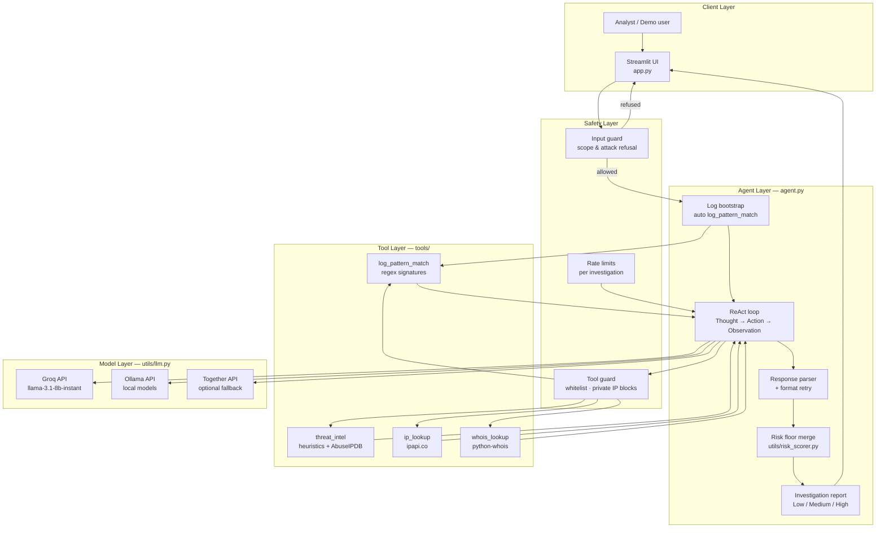
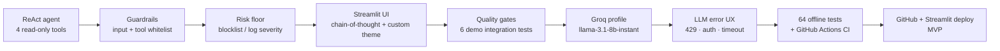
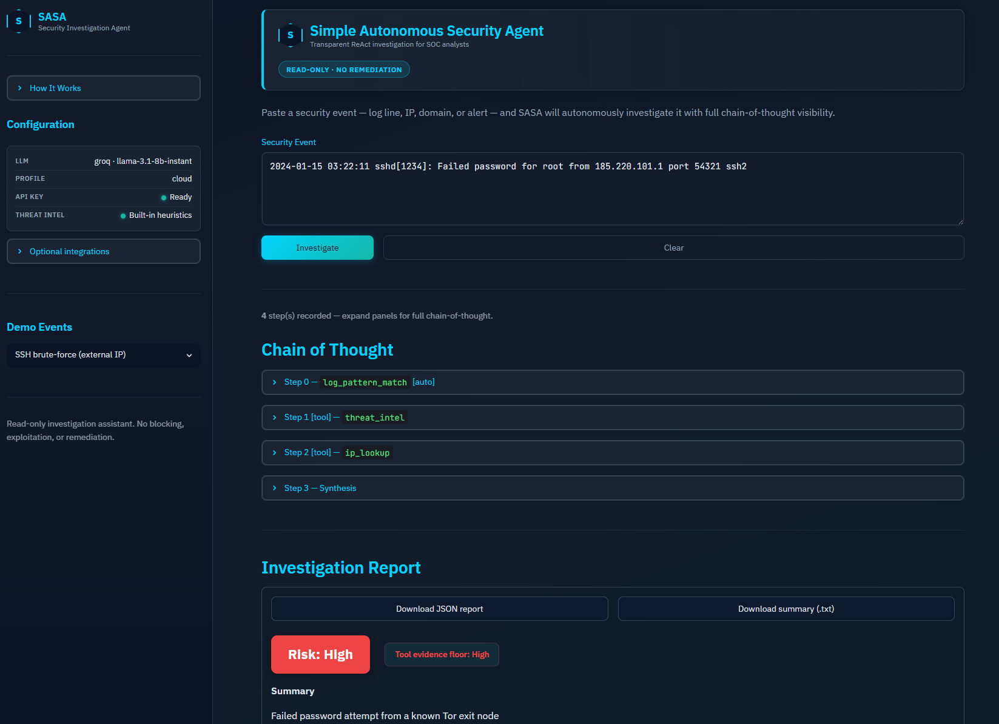

# Simple Autonomous Security Agent (SASA)

A lightweight, transparent **autonomous security investigation agent** for SOC analysts and security learners. Paste a suspicious log line, IP, domain, or alert — SASA runs a **ReAct loop** (Thought → Action → Observation), calls read-only investigation tools, shows its full chain-of-thought, and produces a structured risk report with recommendations.

> **Disclaimer:** SASA is an investigation assistant, not an autonomous blocker or remediation system. It performs read-only lookups and never executes destructive actions.

## 🎯 Problem & Motivation

Security analysts spend significant time triaging noisy alerts: correlating log patterns, checking IP reputation, and deciding whether an event is benign or actionable. Manual context gathering is slow, and opaque “black box” AI tools erode trust in SOC workflows.

**SASA** addresses this by:

- **Autonomously investigating** events with a visible ReAct reasoning loop
- **Enforcing read-only guardrails** — no exploitation, blocking, or off-topic requests
- **Grounding risk ratings in tool evidence** via a deterministic risk floor (LLM cannot under-rate blocklist hits)
- **Supporting hybrid deployment** — Groq for cloud demos, Ollama for offline use

## 🛠️ Tech Stack


| Layer | Technology |
|-------|------------|
| UI | Streamlit |
| Agent | Custom ReAct loop (`agent.py`) |
| LLM | Groq (`llama-3.1-8b-instant`) or Ollama (`gemma3:4b`) via direct HTTP |
| Validation | Pydantic models, guardrails, risk scorer |
| Testing | `unittest` — 64 offline tests + integration quality gates |

## 📊 Data Sources & Attribution

| Source | Used by | Notes |
|--------|---------|-------|
| **Demo events** | `demo/example_events.json` | Synthetic SOC scenarios (SSH brute-force, SQLi, etc.) |
| **Local blocklist / heuristics** | `threat_intel` | Demo Tor/scanner IPs; suspicious TLD patterns |
| **[AbuseIPDB](https://www.abuseipdb.com/)** | `threat_intel` (optional) | Live IP reputation when `ABUSEIPDB_API_KEY` is set |
| **[ipapi.co](https://ipapi.co/)** | `ip_lookup` | Free-tier geolocation / ASN for public IPs |
| **python-whois** | `whois_lookup` | Domain registration metadata |
| **Regex signatures** | `log_pattern_match` | Built-in patterns for brute-force, SQLi, scanners, traversal |

No proprietary datasets are bundled. External APIs are optional and rate-limited.

## 🏗️ Architecture & Design Choices



**Key design decisions:**

- **Direct HTTP to LLMs** — minimal dependencies, Windows-friendly installs
- **Tool risk floor** — report risk = max(LLM rating, tool evidence); blocklist High cannot become Low
- **Auto log scan (Step 0)** — log-like events get `log_pattern_match` before the LLM loop
- **Structured guardrail observations** — private IP / invalid lookup errors returned as JSON the agent can reason about
- **Explicit `LLM_PROVIDER`** — Groq is not auto-selected from key presence alone
- **Server-side API keys** — Groq/Together credentials live in env/secrets only; never sent to the browser or exports

### Development Journey



## 🚀 Live Demo

**[▶ Open the live app on Streamlit Cloud](https://simple-autonomous-security-agent.streamlit.app/)** 

**Screenshot:**



*Screenshot from a run using Groq (`llama-3.1-8b-instant`). Tool evidence and risk ratings are grounded in deterministic checks; LLM-generated narrative text may differ by provider, model, and run.*

Local demo: `streamlit run app.py` → load a sidebar demo event → **Investigate**.

## Quick Start

### Prerequisites

- Python 3.10+
- **Groq** (default): free API key at [console.groq.com](https://console.groq.com)
- **Or Ollama** (local): [ollama.com](https://ollama.com) + `ollama pull gemma3:4b`

### Setup

```bash
git clone https://github.com/rvong65/simple-autonomous-security-agent.git
cd simple-autonomous-security-agent
python -m venv .venv

# Windows
.\.venv\Scripts\Activate.ps1
# macOS / Linux
# source .venv/bin/activate

pip install -r requirements.txt
cp .env.example .env
# Edit .env — add GROQ_API_KEY (or switch to the Ollama block in .env.example)
streamlit run app.py
```

Configuration reference: see `.env.example` (local) and `.streamlit/secrets.toml.example` (Streamlit Cloud).

**Groq batch testing** (all 6 demos — use delay to avoid HTTP 429):

```bash
python scripts/run_demo_investigations.py --delay 15
```

## ✨ Features

- **Autonomous ReAct loop** — up to 8 steps with full transparency
- **4 investigation tools** — log patterns, threat intel, IP lookup, WHOIS (all read-only)
- **Risk floor enforcement** — tool evidence caps minimum report severity
- **Input & tool guardrails** — refuses attacks/off-topic; blocks private IP external lookups
- **Cybersecurity UI** — custom theme, IBM Plex Sans + JetBrains Mono, How It Works sidebar
- **Analyst exports** — downloadable JSON investigation report and plain-text summary (.txt)
- **Friendly LLM errors** — rate limits (429), auth, timeout with optional technical details
- **Hybrid LLM** — Groq (cloud default) or Ollama (local); Together as optional fallback

## 🛡️ Safety Considerations

| Principle | Implementation |
|-----------|----------------|
| Read-only operations | No blocking, deletion, or exploitation tools |
| Input refusal | `check_input()` rejects attack/off-topic prompts |
| Tool whitelist | Only 4 named tools; unknown tools rejected |
| Private IP protection | External intel / geo blocked on RFC1918/reserved IPs |
| Rate limiting | Max tool calls and investigation frequency per session |
| Risk floor | `compute_tool_risk_floor()` prevents under-rating blocklist hits |
| API key hygiene | Groq/Together keys read from server env only — never in UI, exports, or browser |
| Analyst disclaimer | UI + README: correlate with internal telemetry before action |

## 🔄 CI/CD

GitHub Actions runs on every push and pull request to `main` / `master`:

- **Workflow:** `.github/workflows/tests.yml`
- **Scope:** 64 offline unit tests (tools, guardrails, parsing, demos, risk scorer, LLM errors, export format, secret handling)
- **API keys required:** **None** — CI does not call Groq, Ollama, or external threat APIs
- **Integration tests** (`tests.test_integration_investigate`) are run locally or manually when an LLM is configured

This is a **CI pipeline** for regression safety; **CD** (continuous deployment) is handled by Streamlit Cloud on merge to the default branch.

## 📈 Project Status & Build Log

| Step | Focus | Status |
|------|-------|--------|
| 1 | ReAct agent + 4 tools | ✅ |
| 2 | Guardrails + demo events | ✅ |
| 3 | Risk scorer + quality gates | ✅ |
| 4 | Streamlit UI + custom theme | ✅ |
| 5 | Groq integration + error UX | ✅ |
| 6 | 64 offline tests + integration harness | ✅ |
| 7 | GitHub Actions CI | ✅ |
| 8 | Streamlit Cloud deploy | ✅ |

**Current status:** ✅ MVP complete — ready for public demo deploy 

## 📁 Repository Layout

```
├── app.py                      # Streamlit UI
├── agent.py                    # ReAct investigation loop
├── config/settings.py          # LLM provider, limits, secrets loading
├── tools/                      # ip_lookup, whois, log_matcher, threat_intel
├── utils/
│   ├── guardrails.py           # Input/tool safety
│   ├── llm.py                  # Ollama / Groq / Together HTTP client
│   ├── llm_errors.py           # Friendly error mapping
│   ├── risk_scorer.py          # Tool evidence risk floor
│   ├── export_format.py        # JSON + plain-text report exports
│   └── secrets.py              # API key presence checks (no values exposed)
├── docs/screenshots/           # README demo images 
├── demo/example_events.json    # 6 SOC demo scenarios
├── scripts/run_demo_investigations.py
├── tests/                      # Unit + integration tests
├── .github/workflows/tests.yml # CI pipeline
├── .streamlit/config.toml      # Custom theme defaults
├── .env.example                # Local config template (Groq default)
└── requirements.txt
```

## 📄 License

**MIT License** — see [LICENSE](LICENSE).

## 🤝 Contact / Next Steps

Open to feedback, suggestions, and mission-aligned collaboration.

**Potential future directions** *(no promises on timeline)*:

- MITRE ATT&CK technique mapping on log matches
- Investigation history persistence (database / export archive)
- Live step progress during long investigations
- AbuseIPDB-first threat intel profile for production
- PDF / shareable analyst report export
- Additional tool integrations (Passive DNS, VirusTotal)
