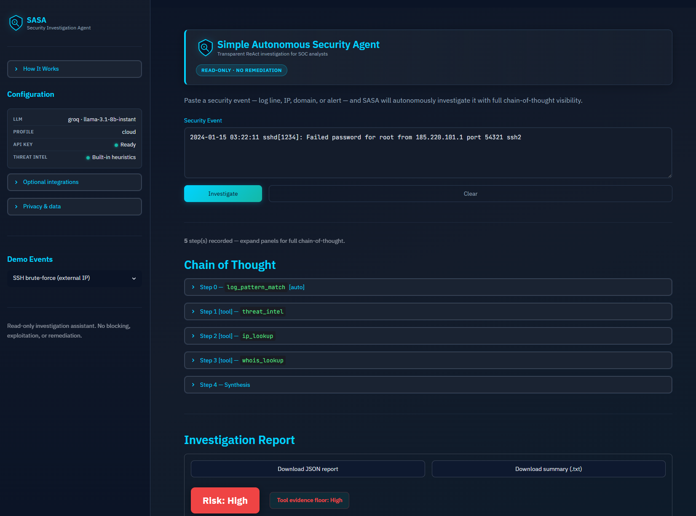

<h1 align="center">
  <picture>
    <source media="(prefers-color-scheme: dark)" srcset="docs/assets/logo-dark.svg">
    <source media="(prefers-color-scheme: light)" srcset="docs/assets/logo-light.svg">
    
  </picture>
</h1>

[](https://github.com/rvong65/simple-autonomous-security-agent/releases)
[](https://github.com/rvong65/simple-autonomous-security-agent/actions/workflows/tests.yml)
[](LICENSE)
[](https://github.com/rvong65/simple-autonomous-security-agent#docker)
[](https://github.com/rvong65/simple-autonomous-security-agent/blob/main/docs/architecture.md)
[](https://simple-autonomous-security-agent.streamlit.app/)

A lightweight, transparent **autonomous security investigation agent** for SOC analysts and security learners. Paste a suspicious log line, IP, domain, or alert — SASA runs a **ReAct loop** (Thought → Action → Observation), calls read-only investigation tools, shows its full chain-of-thought, and produces a structured risk report with recommendations.

> **Disclaimer:** SASA is an investigation assistant, not an autonomous blocker or remediation system. It performs read-only lookups and never executes destructive actions.

> **Privacy (cloud demo):** When you investigate an event, the text you submit is sent to **third-party services** to run the agent — including the configured **LLM provider** (e.g. [Groq](https://groq.com/legal)) and optional tools such as [ipapi.co](https://ipapi.co/api/#introduction) or [AbuseIPDB](https://www.abuseipdb.com/). SASA does not add a separate database of your queries, but **do not paste classified, credentials, or production secrets** into the public Streamlit demo. For sensitive data, run **locally with Ollama** (see [Quick Start](#quick-start)). Details: [Safety → Privacy & data](#privacy-data).

<details open>
<summary><strong>Table of Contents</strong></summary>

| Section | Description |
|---------|-------------|
| **Get started** | |
| 🚀 [Live Demo](#live-demo) | Try the Streamlit app (Cloud or local) |
| ✨ [Features](#features) | Capabilities at a glance |
| ⚡ [Quick Start](#quick-start) | Clone, install, run, test, Docker |
| **Overview** | |
| 🎯 [Problem & Motivation](#problem-motivation) | Why transparent SOC triage matters |
| 🛠️ [Tech Stack](#tech-stack) | Languages, libraries, CI |
| 📊 [Data Sources & Attribution](#data-sources) | Demo events, APIs, runtime LLM attribution |
| 📌 [Version history](#version-history) | Release highlights |
| **Technical** | |
| 🏗️ [Architecture & Design Choices](#architecture-design-choices) | System design and investigation pipeline |
| ↳ [Full architecture doc](docs/architecture.md) | Detailed system design (Mermaid) |
| ↳ [Development Journey](#development-journey) | Build timeline summary |
| 🛡️ [Safety Considerations](#safety-considerations) | Ethics, guardrails, and data privacy |
| 🔄 [CI/CD](#cicd) | GitHub Actions and deployment |
| 📈 [Project Status & Build Log](#project-status) | Milestone checklist |
| 📁 [Repository Layout](#repository-layout) | File tree |
| **Legal & contact** | |
| 📄 [License](#license) | MIT + dataset attribution |
| 🤝 [Contact / Next Steps](#contact) | Feedback and V2 roadmap |

</details>

---

<a id="live-demo"></a>

## 🚀 Live Demo

**[▶ Open the live app on Streamlit Cloud](https://simple-autonomous-security-agent.streamlit.app/)**

**Before you open the app:**
- **Cold start:** This app runs on Streamlit Community Cloud and may go to sleep after inactivity. If you see **“Zzzz — This app has gone to sleep due to inactivity”**, click **“Yes, get this app back up!”** to wake it — anyone can do this; you don’t need to contact the maintainer. Startup may take a minute after you click.
- **Privacy:** The public demo uses a **cloud LLM (Groq)**. Text you submit leaves the browser for SASA’s server and is forwarded to Groq and any tools the agent calls (e.g. IP geolocation). Use **demo/synthetic events only** — not real production logs with secrets. See [Privacy & data](#privacy-data).

**Screenshot:**



*Screenshot from a run using Groq (`llama-3.1-8b-instant`). Tool evidence and risk ratings are grounded in deterministic checks; LLM-generated narrative text may differ by provider, model, and run.*

**Local demo:** `streamlit run app.py` → load a sidebar demo event → **Investigate**.

<a id="features"></a>

## ✨ Features

- **Autonomous ReAct loop** — up to 8 steps with full transparency
- **4 investigation tools** — log patterns, threat intel, IP lookup, WHOIS (all read-only)
- **Risk floor enforcement** — tool evidence caps minimum report severity
- **Input & tool guardrails** — refuses attacks/off-topic; blocks private IP external lookups
- **Cybersecurity UI** — custom theme, IBM Plex Sans + JetBrains Mono, How It Works sidebar
- **Analyst exports** — downloadable JSON investigation report and plain-text summary (.txt)
- **Friendly LLM errors** — rate limits (429), auth, timeout with optional technical details
- **Hybrid LLM** — Groq (cloud default) or Ollama (local); Together as optional fallback

<a id="quick-start"></a>

## Quick Start

### Prerequisites

- Python 3.10+ **or** Docker
- **Groq** (default): free API key at [console.groq.com](https://console.groq.com)
- **Or Ollama** (local): [ollama.com](https://ollama.com) + `ollama pull gemma3:4b`

### Setup (local)

```bash
git clone https://github.com/rvong65/simple-autonomous-security-agent.git
cd simple-autonomous-security-agent
python -m venv .venv

# Windows
.\.venv\Scripts\Activate.ps1
# macOS / Linux
# source .venv/bin/activate

pip install -r requirements.txt
cp .env.example .env
# Edit .env — add GROQ_API_KEY (or switch to the Ollama block in .env.example)
streamlit run app.py
```

Configuration reference: see `.env.example` (local) and `.streamlit/secrets.toml.example` (Streamlit Cloud).

**Groq batch testing** (all 6 demos — use delay to avoid HTTP 429):

```bash
python scripts/run_demo_investigations.py --delay 15
```

<a id="docker"></a>

### Docker

**Groq (default)** — create `.env` with `GROQ_API_KEY`:

```bash
docker compose up --build
# Open http://localhost:8501
```

**Ollama profile** — set in `.env`:

```env
LLM_PROVIDER=ollama
OLLAMA_BASE_URL=http://ollama:11434
LLM_MODEL=gemma3:4b
```

```bash
docker compose --profile ollama up --build
docker compose exec ollama ollama pull gemma3:4b
```

See [docs/architecture.md#deployment-topologies](docs/architecture.md#deployment-topologies) for details.

---

<a id="problem-motivation"></a>

## 🎯 Problem & Motivation

Security analysts spend significant time triaging noisy alerts: correlating log patterns, checking IP reputation, and deciding whether an event is benign or actionable. Manual context gathering is slow, and opaque “black box” AI tools erode trust in SOC workflows.

**SASA** addresses this by:

- **Autonomously investigating** events with a visible ReAct reasoning loop
- **Enforcing read-only guardrails** — no exploitation, blocking, or off-topic requests
- **Grounding risk ratings in tool evidence** via a deterministic risk floor (LLM cannot under-rate blocklist hits)
- **Supporting hybrid deployment** — Groq for cloud demos, Ollama for offline use

<a id="tech-stack"></a>

## 🛠️ Tech Stack


| Layer | Technology |
|-------|------------|
| UI | Streamlit |
| Agent | Custom ReAct loop (`agent.py`) |
| LLM | Groq (`llama-3.1-8b-instant`) or Ollama (`gemma3:4b`) via direct HTTP |
| Validation | Pydantic models, guardrails, risk scorer |
| Packaging | Docker + docker-compose (Groq default, Ollama profile) |
| Testing | `unittest` — 64 offline tests + integration quality gates |

<a id="data-sources"></a>

## 📊 Data Sources & Attribution

| Source | Used by | Notes |
|--------|---------|-------|
| **Demo events** | `demo/example_events.json` | Synthetic SOC scenarios (SSH brute-force, SQLi, etc.) |
| **Local blocklist / heuristics** | `threat_intel` | Demo Tor/scanner IPs; suspicious TLD patterns |
| **[AbuseIPDB](https://www.abuseipdb.com/)** | `threat_intel` (optional) | Live IP reputation when `ABUSEIPDB_API_KEY` is set |
| **[ipapi.co](https://ipapi.co/)** | `ip_lookup` | Free-tier geolocation / ASN for public IPs |
| **python-whois** | `whois_lookup` | Domain registration metadata |
| **Regex signatures** | `log_pattern_match` | Built-in patterns for brute-force, SQLi, scanners, traversal |

**Models used at runtime** (not redistributed in this repo):

| Model | Role | License / acknowledgment |
|-------|------|--------------------------|
| `gemma3:4b` (Ollama) | Local dev LLM | [Gemma Terms of Use](https://ai.google.dev/gemma/terms) |
| `llama-3.1-8b-instant` (Groq) | Cloud demo LLM | Meta Llama via Groq API — [Groq Terms](https://groq.com/terms/) |

No proprietary datasets are bundled. External APIs and LLM providers are optional and subject to their respective terms and rate limits.

<a id="version-history"></a>

## 📌 Version history

| Version | Date | Highlights |
|---------|------|------------|
| **[v1.1.1](CHANGELOG.md#111---2026-06-23)** | 2026-06-23 | Privacy & data disclosures (README + Streamlit sidebar) |
| **[v1.1.0](CHANGELOG.md#110---2026-06-23)** | 2026-06-23 | Docker, architecture doc, branding assets, collapsible ToC, CHANGELOG, Docker CI |
| **[v1.0.0](CHANGELOG.md#100---2026-06-17)** | 2026-06-17 | MVP: ReAct agent, 4 tools, risk floor, Streamlit UI, CI, public Streamlit deploy |

Full details: **[CHANGELOG.md](CHANGELOG.md)** 

---

<a id="architecture-design-choices"></a>

## 🏗️ Architecture & Design Choices

Security events flow through input guard → optional Step 0 log scan → ReAct investigation (LLM + read-only tools) → deterministic risk floor merge → structured report and JSON/TXT export in the Streamlit UI. Guardrails and tool evidence keep output analyst-ready without opaque black-box scoring.

**Full design** — goals, end-to-end diagram, module map, deployment topologies (local / Docker / Streamlit Cloud), and architecture-level safety: **[docs/architecture.md](docs/architecture.md)**

**Key design decisions**

| Decision | Rationale |
|----------|-----------|
| Custom ReAct loop | Full control over prompts, parsing, guardrails, and visible chain-of-thought |
| Tool risk floor | Report risk = max(LLM rating, tool evidence); blocklist High cannot become Low |
| Step 0 log bootstrap | Log-like events always get `log_pattern_match` before the LLM loop |
| Direct HTTP to LLMs | Minimal dependencies; Windows-friendly; explicit Groq 429 retry |
| Structured guardrail observations | Private IP / invalid lookup errors as JSON the agent can reason about |
| Server-side API keys | Groq/Together credentials in env/secrets only — never in browser or exports |
| Reproducibility | Docker image; 64 offline CI tests; integration quality gates on six demos |

<a id="development-journey"></a>

### Development Journey

Built incrementally from a four-tool ReAct agent through guardrails, risk floor, Streamlit UI, Groq integration, and CI/deploy. Notable fixes: risk floor after Tor blocklist under-rating; Step 0 bootstrap after log matcher skips; Groq 429 retry for batch demos.

Build timeline and deployment details: [docs/architecture.md#development-journey](docs/architecture.md#development-journey).

<a id="safety-considerations"></a>

## 🛡️ Safety Considerations

| Principle | Implementation |
|-----------|----------------|
| Read-only operations | No blocking, deletion, or exploitation tools |
| Input refusal | `check_input()` rejects attack/off-topic prompts |
| Tool whitelist | Only 4 named tools; unknown tools rejected |
| Private IP protection | External intel / geo blocked on RFC1918/reserved IPs |
| Rate limiting | Max tool calls and investigation frequency per session |
| Risk floor | `compute_tool_risk_floor()` prevents under-rating blocklist hits |
| API key hygiene | Groq/Together keys read from server env only — never in UI, exports, or browser |
| Analyst disclaimer | UI + README: correlate with internal telemetry before action |

<a id="privacy-data"></a>

### Privacy & data handling

SASA is designed for **investigation assistance**, not as a certified data-processing platform. Understand where your input goes:

| Data you submit | Where it may be sent | Notes |
|-----------------|----------------------|-------|
| Event text (logs, IPs, domains) | **LLM provider** (Groq, Together, or local Ollama) | Cloud providers process prompts per their own [terms](https://groq.com/terms/) and privacy policies |
| ReAct conversation context | Same LLM provider | Prior thoughts/actions in the run are included in API requests |
| Public IPs / domains (tools) | **ipapi.co**, optional **AbuseIPDB**, **WHOIS** | Only when the agent calls those tools |
| Session state | Streamlit app memory | Cleared when the session ends; **not** written to a project database by SASA |
| Exports you download | Your machine only | JSON/TXT files are generated in the browser for you to save |

**Public Streamlit Cloud demo:** Treat it like any shared SaaS triage UI — **no classified data, credentials, PII, or live production secrets**. Prefer sidebar **demo events** or synthetic lines for testing.

**Sensitive environments:** Run on your own machine or Docker with **`LLM_PROVIDER=ollama`** so event text stays on your network (tool calls to external APIs still apply unless you disable/limit tools).

**Maintainer:** This repo does not intentionally log investigation content to disk. Streamlit Cloud and cloud API providers have their own operational logging — review their documentation if compliance matters.

<a id="cicd"></a>

## 🔄 CI/CD

**GitHub Actions** runs on every push and pull request to `main` / `master`:

| Job | Step | Action |
|-----|------|--------|
| **offline-tests** | Trigger | Push or PR to `main` / `master` |
| | Environment | `ubuntu-latest`, Python 3.11 |
| | Install | `pip install -r requirements.txt` |
| | Test | `python -m unittest` — 64 offline tests (tools, guardrails, parsing, demos, risk scorer, LLM errors, export format, secret handling) |
| **docker-smoke** | Build | `docker build -t sasa:ci .` |
| | Run | Container on port 8501 (placeholder `GROQ_API_KEY` for startup) |
| | Health | Streamlit `/_stcore/health` |

Workflow file: [`.github/workflows/tests.yml`](.github/workflows/tests.yml)

**No API keys in CI** — offline tests use fixtures and mocks only; the Docker job checks that the image starts and Streamlit responds.

**Integration tests** (`tests.test_integration_investigate`) and **`scripts/run_demo_investigations.py`** require a configured LLM (Groq or Ollama) and are run locally or manually — not part of the CI workflow.

**Streamlit Cloud** deploys independently from the `main` branch when connected to this repository (`app.py` + `requirements.txt` + Streamlit Secrets).

<a id="project-status"></a>

## 📈 Project Status & Build Log

| Step | Focus | Status |
|------|-------|--------|
| 1 | ReAct agent + 4 tools | ✅ |
| 2 | Guardrails + demo events | ✅ |
| 3 | Risk scorer + quality gates | ✅ |
| 4 | Streamlit UI + custom theme | ✅ |
| 5 | Groq integration + error UX | ✅ |
| 6 | 64 offline tests + integration harness | ✅ |
| 7 | GitHub Actions CI | ✅ |
| 8 | Streamlit Cloud deploy | ✅ |
| 9 | v1.1 — Docker, architecture doc, branding, CHANGELOG | ✅ |
| 10 | v1.1.1 — privacy & cloud data disclosures | ✅ |

**Current status:** ✅ v1.1.1 — MVP + packaging + privacy disclosures

<a id="repository-layout"></a>

## 📁 Repository Layout

```
├── app.py                      # Streamlit UI
├── agent.py                    # ReAct investigation loop
├── version.py                  # Application version (1.1.1)
├── config/settings.py          # LLM provider, limits, secrets loading
├── tools/                      # ip_lookup, whois, log_matcher, threat_intel
├── utils/
│   ├── guardrails.py           # Input/tool safety
│   ├── llm.py                  # Ollama / Groq / Together HTTP client
│   ├── llm_errors.py           # Friendly error mapping
│   ├── risk_scorer.py          # Tool evidence risk floor
│   ├── export_format.py        # JSON + plain-text report exports
│   └── secrets.py              # API key presence checks (no values exposed)
├── docs/
│   ├── architecture.md         # Full system design
│   ├── assets/                 # icon, favicon, logo (light/dark)
│   └── screenshots/            # README demo images
├── demo/example_events.json    # 6 SOC demo scenarios
├── scripts/run_demo_investigations.py
├── tests/                      # Unit + integration tests
├── Dockerfile                  # Container image
├── docker-compose.yml          # Groq default; ollama profile
├── CHANGELOG.md                # Version-by-version change history
├── .github/workflows/tests.yml # CI pipeline + Docker smoke
├── .streamlit/config.toml      # Custom theme defaults
├── .env.example                # Local config template (Groq default)
├── LICENSE                     # MIT
└── requirements.txt            # App + Streamlit Cloud runtime deps
```

---

<a id="license"></a>

## 📄 License

**MIT License** — see [LICENSE](LICENSE).

Dataset and runtime model attribution: see [Data Sources & Attribution](#data-sources).

<a id="contact"></a>

## 🤝 Contact / Next Steps

Open to feedback, suggestions, and mission-aligned collaboration.

### V2 roadmap (planned)

| Area | Direction |
|------|-----------|
| **GenAI / agents** | Structured LLM output (JSON mode); optional investigation trace export |
| **Threat intel** | AbuseIPDB-first profile; Passive DNS / VirusTotal tool integrations |
| **Security taxonomy** | MITRE ATT&CK technique mapping on log pattern matches |
| **Platform** | Investigation history persistence (database / export archive) |
| **UX** | Live step progress during long investigations; PDF analyst report export |

