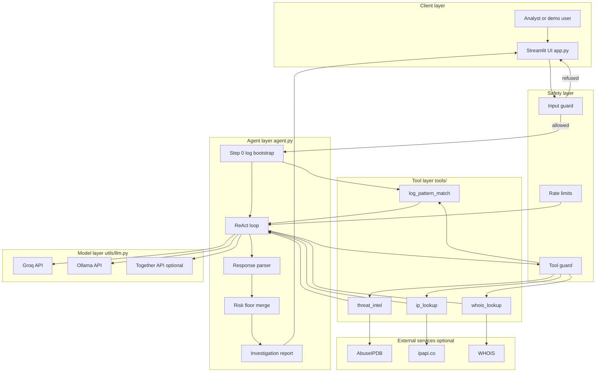
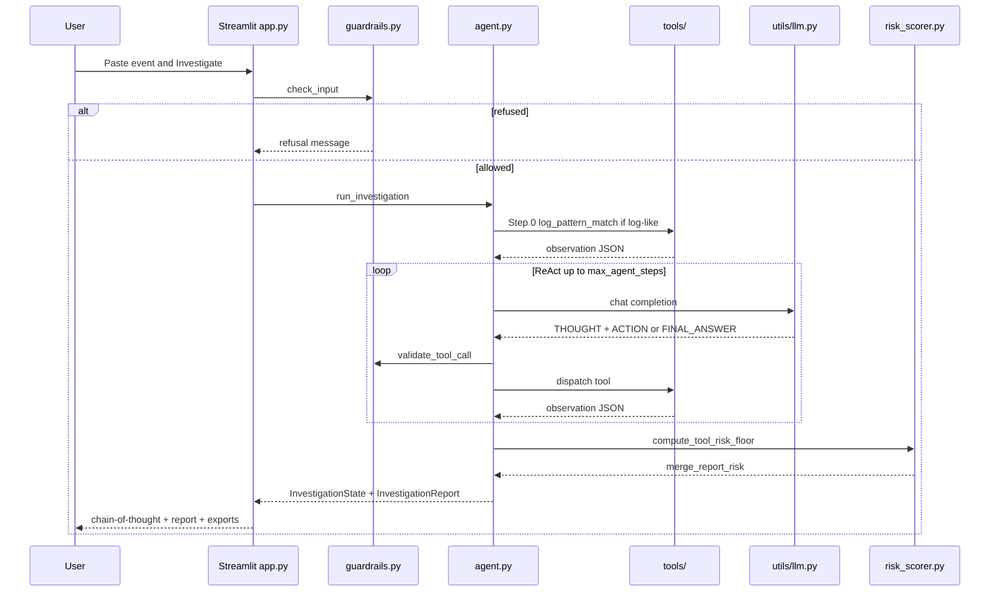

# Architecture & System Design

Full system design for the **Simple Autonomous Security Agent**. The [README](../README.md) summarizes this document; use this page for diagrams, module maps, deployment topologies, and architecture-level safety.

---

## Goals

| Goal | Approach |
|------|----------|
| Transparent SOC triage | Visible ReAct loop (Thought → Action → Observation) in the Streamlit UI |
| Analyst trust | Deterministic tool evidence + risk floor; LLM cannot under-rate blocklist hits |
| Read-only safety | Four whitelisted lookup tools; input/tool guardrails; no remediation actions |
| Hybrid deployment | Groq for cloud demos; Ollama for local/offline; optional Together fallback |
| Reproducibility | Docker image; 64 offline CI tests; integration quality gates on six demo scenarios |
| Portable exports | JSON investigation report + plain-text summary for tickets/SIEM notes |

---

## End-to-end system diagram



### Investigation sequence (single run)



---

## Repository modules

| Path | Role |
|------|------|
| [`app.py`](../app.py) | Streamlit UI, theme, config card, exports, session state |
| [`agent.py`](../agent.py) | ReAct loop, parsing, log bootstrap, report synthesis |
| [`config/settings.py`](../config/settings.py) | Pydantic settings, Streamlit secrets → env, cloud defaults |
| [`tools/`](../tools/) | Read-only investigation tools and dispatch registry |
| [`utils/guardrails.py`](../utils/guardrails.py) | Input refusal, tool whitelist, private IP blocks, rate limits |
| [`utils/llm.py`](../utils/llm.py) | Direct HTTP to Groq, Ollama, Together; 429 retry |
| [`utils/llm_errors.py`](../utils/llm_errors.py) | Friendly error mapping for UI |
| [`utils/risk_scorer.py`](../utils/risk_scorer.py) | Deterministic risk floor from tool observations |
| [`utils/export_format.py`](../utils/export_format.py) | JSON and plain-text export builders |
| [`utils/secrets.py`](../utils/secrets.py) | API key presence checks (never expose values) |
| [`demo/example_events.json`](../demo/example_events.json) | Six synthetic SOC demo scenarios |
| [`tests/`](../tests/) | Offline unit tests + optional LLM integration quality gates |
| [`version.py`](../version.py) | Application version string |

---

## Pipeline summary

1. **Ingest** — User pastes a log line, IP, domain, or alert text into Streamlit.
2. **Input guard** — `check_input()` rejects offensive or off-topic prompts.
3. **Indicator extraction** — IPs and domains parsed from event text.
4. **Step 0 bootstrap** — If input looks log-like, `log_pattern_match` runs automatically before the first LLM turn.
5. **ReAct loop** — LLM chooses tools or emits `FINAL_ANSWER`; parser validates format; guardrails gate each tool call.
6. **Tool execution** — Observations returned as JSON strings appended to conversation history.
7. **Risk merge** — `compute_tool_risk_floor()` + `merge_report_risk()` cap minimum severity from evidence.
8. **Present & export** — UI renders steps and report; user downloads JSON/TXT artifacts.

---

## Key design decisions

| Decision | Rationale |
|----------|-----------|
| Custom ReAct loop (no agent framework) | Full control over prompts, parsing, guardrails, and step recording; minimal dependencies |
| Direct HTTP to LLMs | Avoids LiteLLM install issues on Windows; simple error handling and retry |
| Tool risk floor | Prevents LLM from rating known blocklist hits as Low — preserves analyst trust |
| Step 0 log bootstrap | LLM sometimes skipped log analysis; deterministic baseline before ReAct |
| Structured guardrail observations | Private IP / invalid lookup errors as JSON the agent can reason about |
| Explicit `LLM_PROVIDER` | Groq not auto-selected from key presence alone — predictable deployment |
| Server-side API keys | Groq/Together keys in env/secrets only — never in browser or exports |
| Offline CI without LLM keys | 64 deterministic tests on every push; integration tests run when LLM configured |
| Schema-versioned JSON export | Analyst records with parsed observations and metadata (no secrets) |

---

## Development journey

```mermaid
flowchart LR
    A[ReAct agent 4 tools] --> B[Guardrails]
    B --> C[Risk floor]
    C --> D[Streamlit UI]
    D --> E[Integration quality gates]
    E --> F[Groq profile]
    F --> G[LLM error UX]
    G --> H[64 offline tests CI]
    H --> I[v1.0 Streamlit Cloud]
    I --> J[v1.1 Docker docs branding]
```



Notable fixes during v1.0 development:

- **Risk floor** — Tor blocklist High was once rated Low by the LLM; floor merge fixed it.
- **Log bootstrap** — SSH demo skipped `log_pattern_match` until Step 0 auto-run.
- **Groq 429** — Retry backoff and batch `--delay` for demo script.

---

## Deployment topologies

### Local development

```bash
python -m venv .venv
pip install -r requirements.txt
cp .env.example .env   # add GROQ_API_KEY or Ollama settings
streamlit run app.py
```

Best for active development and integration tests with a live LLM.

### Docker

**Groq (default)** — `.env` with `GROQ_API_KEY`:

```bash
docker compose up --build
# Open http://localhost:8501
```

**Ollama profile** — set in `.env`:

```env
LLM_PROVIDER=ollama
OLLAMA_BASE_URL=http://ollama:11434
LLM_MODEL=gemma3:4b
```

```bash
docker compose --profile ollama up --build
docker compose exec ollama ollama pull gemma3:4b
```

The app container reads secrets from `.env` via `env_file`. Do not bake API keys into the image.

### Streamlit Cloud

- Connect GitHub repo; deploy on merge to default branch.
- Secrets via Streamlit Secrets UI → flattened into `os.environ` in `load_streamlit_secrets_into_env()`.
- See [`.streamlit/secrets.toml.example`](../.streamlit/secrets.toml.example).
- Live demo: [simple-autonomous-security-agent.streamlit.app](https://simple-autonomous-security-agent.streamlit.app/)

Cold starts: Community Cloud apps sleep after inactivity; users wake the app from the Streamlit UI.

---

## Security and safety (architecture-level)

| Concern | Mitigation |
|---------|------------|
| Destructive actions | No block/exploit/delete tools; read-only lookups only |
| Prompt abuse / off-topic | Input guard patterns; security-intent heuristics |
| Tool injection | Whitelist of four tools; per-tool parameter allowlists |
| Internal IP leakage | Private/reserved IPs blocked for external TI and geo APIs |
| API key exposure | Keys in server env only; UI shows Ready/Missing; not in exports |
| Rate / cost abuse | Per-session investigation limit; max tool calls per run |
| LLM under-rating threats | Deterministic risk floor from tool observations |
| Over-trust in AI output | Full chain-of-thought visible; analyst disclaimer in UI and exports |
| Cloud user data | README + UI privacy notices; recommend demo/synthetic input on public Groq demo; Ollama for sensitive runs |

Architecture-level principle: **evidence gathering is automated; decision authority stays with the analyst**, who must correlate with internal telemetry before action.

**Privacy:** Investigation text is transmitted to configured LLM and tool APIs (Groq, ipapi.co, etc.). SASA does not persist queries to a project database; see README [Privacy & data](../README.md#privacy-data).

---

## Version

Document version: v1.1.1 (aligned with [CHANGELOG.md](../CHANGELOG.md#111---2026-06-23))

| Release | Architecture highlights |
|---------|------------|
| **v1.1.1** | Privacy & data disclosures — README Safety section, Streamlit sidebar expander |
| **v1.1.0** | Engineering maturity — Docker, `docs/architecture.md`, SVG assets, CHANGELOG, Docker CI |
| **v1.0.0** | SASA MVP, Streamlit Cloud, Groq cloud profile, CI tests |
